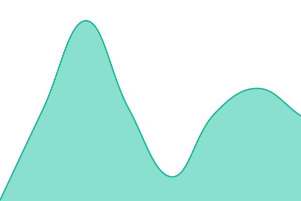
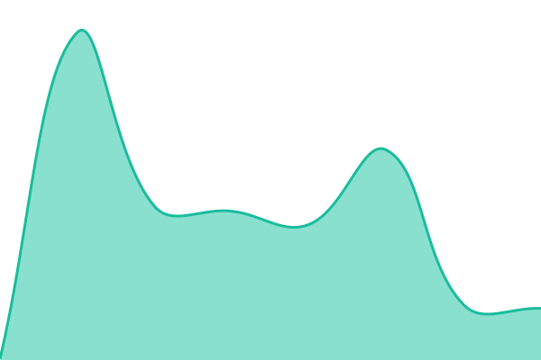
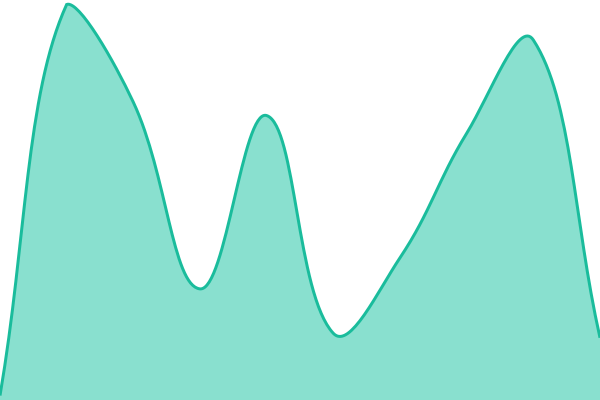
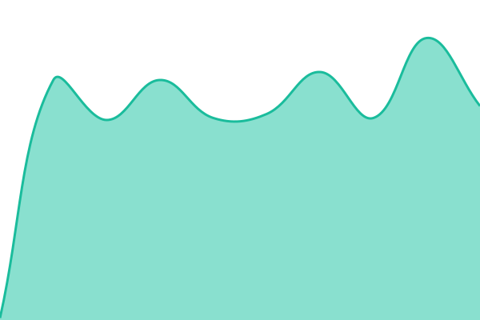

# [📈 Live Status](https://h6rd.github.io/Dota2PornFxStatus): <!--live status--> **🟧 Partial outage**

This repository contains the open-source uptime monitor and status page for [hrdq](https://h6rd.github.io/Dota2PornFxStatus), powered by [Upptime](https://github.com/upptime/upptime).

With [Upptime](https://upptime.js.org), you can get your own unlimited and free uptime monitor and status page, powered entirely by a GitHub repository. We use [Issues](https://github.com/h6rd/Dota2PornFxStatus/issues) as incident reports, [Actions](https://github.com/h6rd/Dota2PornFxStatus/actions) as uptime monitors, and [Pages](https://h6rd.github.io/Dota2PornFxStatus) for the status page.

<!--start: status pages-->
<!-- This summary is generated by Upptime (https://github.com/upptime/upptime) -->
<!-- Do not edit this manually, your changes will be overwritten -->
<!-- prettier-ignore -->
| URL | Status | History | Response Time | Uptime |
| --- | ------ | ------- | ------------- | ------ |
|  [GitHub](https://h6rd.github.io/Dota2PornFxWeb/) | 🟩 Up | [git-hub.yml](https://github.com/h6rd/Dota2PornFxStatus/commits/HEAD/history/git-hub.yml) | 

 124ms
     
 | 

<a href="https://h6rd.github.io/Dota2PornFxStatus/history/git-hub">100.00%</a>
    

|  [Vercel](https://d2pfx.vercel.app/) | 🟩 Up | [vercel.yml](https://github.com/h6rd/Dota2PornFxStatus/commits/HEAD/history/vercel.yml) | 

 273ms
     
 | 

<a href="https://h6rd.github.io/Dota2PornFxStatus/history/vercel">100.00%</a>
    

|  [Netlify](https://d2pfx.netlify.app/) | 🟥 Down | [netlify.yml](https://github.com/h6rd/Dota2PornFxStatus/commits/HEAD/history/netlify.yml) | 

 89ms
     
 | 

<a href="https://h6rd.github.io/Dota2PornFxStatus/history/netlify">23.11%</a>
    

|  [Render](https://d2pfx.onrender.com/) | 🟥 Down | [render.yml](https://github.com/h6rd/Dota2PornFxStatus/commits/HEAD/history/render.yml) | 

 120ms
     
 | 

<a href="https://h6rd.github.io/Dota2PornFxStatus/history/render">31.78%</a>
    

|  [Codeberg](https://hrdq.codeberg.pages/hrdq/Dota2PornFxWeb/) | 🟥 Down | [codeberg.yml](https://github.com/h6rd/Dota2PornFxStatus/commits/HEAD/history/codeberg.yml) | 

 0ms
     
 | 

<a href="https://h6rd.github.io/Dota2PornFxStatus/history/codeberg">80.75%</a>
    

<!--end: status pages-->

[**Visit our status website →**](https://h6rd.github.io/Dota2PornFxStatus)

## 📄 License

- Powered by: [Upptime](https://github.com/upptime/upptime)
- Code: [MIT](./LICENSE) © [Anand Chowdhary](https://anandchowdhary.com)
- Data in the `./history` directory: [Open Database License](https://opendatacommons.org/licenses/odbl/1-0/)
