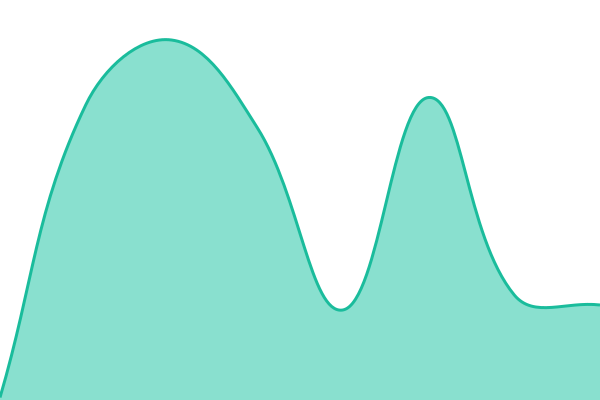
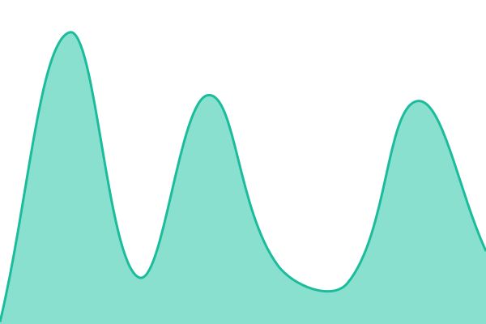
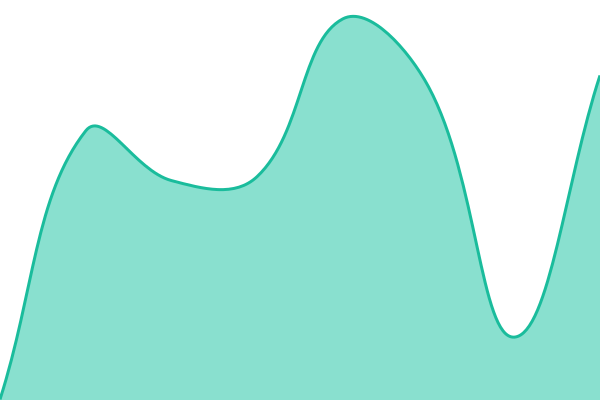
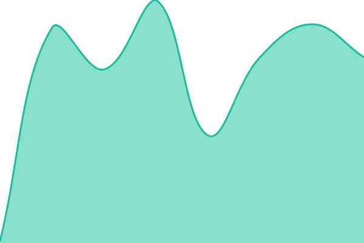

# Live Status

<!--start: status pages-->
<!-- This summary is generated by Upptime (https://github.com/upptime/upptime) -->
<!-- Do not edit this manually, your changes will be overwritten -->
<!-- prettier-ignore -->
| URL | Status | History | Response Time | Uptime |
| --- | ------ | ------- | ------------- | ------ |
|  [GitHub](https://h6rd.github.io/Dota2PornFxWeb/) | 🟩 Up | [git-hub.yml](https://github.com/h6rd/Dota2PornFxStatus/commits/HEAD/history/git-hub.yml) | 

 102ms
     
 | 

<a href="https://h6rd.github.io/Dota2PornFxStatus/history/git-hub">100.00%</a>
    

|  [Vercel](https://d2pfx.vercel.app/) | 🟥 Down | [vercel.yml](https://github.com/h6rd/Dota2PornFxStatus/commits/HEAD/history/vercel.yml) | 

 51ms
     
 | 

<a href="https://h6rd.github.io/Dota2PornFxStatus/history/vercel">0.00%</a>
    

|  [Netlify](https://d2pfx.netlify.app/) | 🟩 Up | [netlify.yml](https://github.com/h6rd/Dota2PornFxStatus/commits/HEAD/history/netlify.yml) | 

 245ms
     
 | 

<a href="https://h6rd.github.io/Dota2PornFxStatus/history/netlify">42.72%</a>
    

|  [Render](https://d2pfx.onrender.com/) | 🟩 Up | [render.yml](https://github.com/h6rd/Dota2PornFxStatus/commits/HEAD/history/render.yml) | 

 146ms
     
 | 

<a href="https://h6rd.github.io/Dota2PornFxStatus/history/render">42.72%</a>
    

<!--end: status pages-->

## 📄 License

- Powered by: [Upptime](https://github.com/upptime/upptime)
- Code: [MIT](./LICENSE) © [Anand Chowdhary](https://anandchowdhary.com)
- Data in the `./history` directory: [Open Database License](https://opendatacommons.org/licenses/odbl/1-0/)
